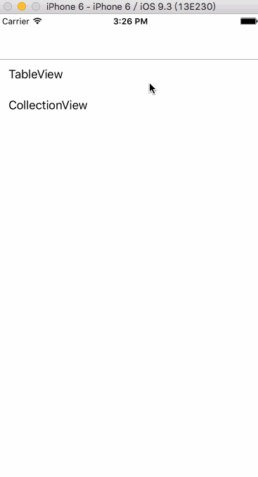

# 【联动】：两个TableView之间的联动，TableView与CollectionView之间的联动
## 前言
现在市面上有很多app都有联动功能，有的是两个TableView之间的联动，比如美团外卖，百度外卖，饿了么等等。有的是TableView与CollectionView之间的联动，比如礼物说等等。

本文仿造了美团外卖和礼物说，分别实现了两个TableView之间和TablView与CollectionView之间的联动效果，效果图看下面的gif图。

先附上gif图的demo下载链接，[【GitHub】](https://github.com/leejayID/Linkage)、[【Code4App】](http://www.code4app.com/forum.php?mod=viewthread&tid=10225&page=1&extra=#pid248338
)、[【OSChina】](https://git.oschina.net/Lee_Jay/Linkage)，简书文章[地址](http://www.jianshu.com/p/7e534656988d)，CSDN文章[地址](http://blog.csdn.net/leejay_carson/article/details/52293313)，配合demo一起看文章，效果会更佳。



## 正文
### 一、TableView与TableView之间的联动
下面来说下实现两个TableView之间联动的主要思路：

先解析数据装入模型，```objectWithDictionary:```是将字典转化为模型，这个工具是我用runtime写的，一行代码解析数据，具体使用方法可以参考我简书上另一篇文章[【Objective-C中的Runtime】](http://www.jianshu.com/p/3e050ec3b759)。
```objc
NSString *path = [[NSBundle mainBundle] pathForResource:@"meituan" ofType:@"json"];
NSData *data = [NSData dataWithContentsOfFile:path];
NSDictionary *dict = [NSJSONSerialization JSONObjectWithData:data options:NSJSONReadingAllowFragments error:nil];
NSArray *foods = dict[@"data"][@"food_spu_tags"];

for (NSDictionary *dict in foods)
{
    CategoryModel *model = [CategoryModel objectWithDictionary:dict];
    [self.categoryData addObject:model];

    NSMutableArray *datas = [NSMutableArray array];
    for (FoodModel *f_model in model.spus)
    {
        [datas addObject:f_model];
    }
    [self.foodData addObject:datas];
}
```

定义两个TableView：LeftTableView和RightTableView。
```objc
- (UITableViewCell *)tableView:(UITableView *)tableView cellForRowAtIndexPath:(NSIndexPath *)indexPath
{
    if (_leftTableView == tableView)
    {
        LeftTableViewCell *cell = [tableView dequeueReusableCellWithIdentifier:kCellIdentifier_Left forIndexPath:indexPath];
        FoodModel *model = self.categoryData[indexPath.row];
        cell.name.text = model.name;
        return cell;
    }
    else
    {
        RightTableViewCell *cell = [tableView dequeueReusableCellWithIdentifier:kCellIdentifier_Right forIndexPath:indexPath];
        FoodModel *model = self.productData[indexPath.section][indexPath.row];
        cell.model = model;
        return cell;
    }
}
```

先将左边的TableView关联右边的TableView：点击左边的TableViewCell，右边的TableView跳到相应的分区列表头部。
```objc
- (void)tableView:(UITableView *)tableView didSelectRowAtIndexPath:(nonnull NSIndexPath *)indexPath
{
    if (_leftTableView == tableView)
    {
        _selectIndex = indexPath.row;
        [_rightTableView scrollToRowAtIndexPath:[NSIndexPath indexPathForRow:0 inSection:_selectIndex] atScrollPosition:UITableViewScrollPositionTop animated:YES];
    }
}
```

再将右边的TableView关联左边的TableView：标记一下RightTableView的滚动方向，然后分别在TableView分区标题即将展示和展示结束的代理函数里面处理逻辑。
* 1.在TableView分区标题即将展示里面，判断当前的tableView是RightTableView，RightTableView滑动的方向向上，RightTableView是用户拖拽而产生滚动的（主要判断RightTableView是用户拖拽的，还是点击LeftTableView滚动的），如果三者都成立，那么LeftTableView的选中行就是RightTableView的当前section。
* 2.在TableView分区标题展示结束里面，判断当前的tableView是RightTableView，滑动的方向向下，RightTableView是用户拖拽而产生滚动的，如果三者都成立，那么LeftTableView的选中行就是RightTableView的当前section-1。

```objc
// 标记一下RightTableView的滚动方向，是向上还是向下
- (void)scrollViewDidScroll:(UIScrollView *)scrollView
{
    static CGFloat lastOffsetY = 0;

    UITableView *tableView = (UITableView *) scrollView;
    if (_rightTableView == tableView)
    {
        _isScrollDown = lastOffsetY < scrollView.contentOffset.y;
        lastOffsetY = scrollView.contentOffset.y;
    }
}

// TableView分区标题即将展示
- (void)tableView:(UITableView *)tableView willDisplayHeaderView:(nonnull UIView *)view forSection:(NSInteger)section
{
    // 当前的tableView是RightTableView，RightTableView滚动的方向向上，RightTableView是用户拖拽而产生滚动的（（主要判断RightTableView用户拖拽而滚动的，还是点击LeftTableView而滚动的）
    if ((_rightTableView == tableView) && !_isScrollDown && _rightTableView.dragging)
    {
        [self selectRowAtIndexPath:section];
    }
}

// TableView分区标题展示结束
- (void)tableView:(UITableView *)tableView didEndDisplayingHeaderView:(UIView *)view forSection:(NSInteger)section
{
    // 当前的tableView是RightTableView，RightTableView滚动的方向向下，RightTableView是用户拖拽而产生滚动的（主要判断RightTableView用户拖拽而滚动的，还是点击LeftTableView而滚动的）
    if ((_rightTableView == tableView) && _isScrollDown && _rightTableView.dragging)
    {
        [self selectRowAtIndexPath:section + 1];
    }
}

// 当拖动右边TableView的时候，处理左边TableView
- (void)selectRowAtIndexPath:(NSInteger)index
{
    [_leftTableView selectRowAtIndexPath:[NSIndexPath indexPathForRow:index inSection:0] animated:YES scrollPosition:UITableViewScrollPositionTop];
}
```

这样就实现了两个TableView之间的联动，是不是很简单。
### 二、TableView与CollectionView之间的联动
TableView与CollectionView之间的联动与两个TableView之间的联动逻辑类似。

下面说下实现TableView与CollectionView之间的联动的主要思路：

还是一样，先解析数据装入模型。

```objc
NSString *path = [[NSBundle mainBundle] pathForResource:@"liwushuo" ofType:@"json"];
NSData *data = [NSData dataWithContentsOfFile:path];
NSDictionary *dict = [NSJSONSerialization JSONObjectWithData:data options:NSJSONReadingAllowFragments error:nil];
NSArray *categories = dict[@"data"][@"categories"];

for (NSDictionary *dict in categories)
{
    CollectionCategoryModel *model =
    [CollectionCategoryModel objectWithDictionary:dict];
    [self.dataSource addObject:model];

    NSMutableArray *datas = [NSMutableArray array];
    for (SubCategoryModel *sModel in model.subcategories)
    {
        [datas addObject:sModel];
    }
    [self.collectionDatas addObject:datas];
}
```

定义一个TableView，一个CollectionView。
```objc
- (UITableViewCell *)tableView:(UITableView *)tableView cellForRowAtIndexPath:(NSIndexPath *)indexPath
{
    LeftTableViewCell *cell = [tableView dequeueReusableCellWithIdentifier:kCellIdentifier_Left forIndexPath:indexPath];
    CollectionCategoryModel *model = self.dataSource[indexPath.row];
    cell.name.text = model.name;
    return cell;
}

- (UICollectionViewCell *)collectionView:(UICollectionView *)collectionView cellForItemAtIndexPath:(NSIndexPath *)indexPath
{
    CollectionViewCell *cell = [collectionView dequeueReusableCellWithReuseIdentifier:kCellIdentifier_CollectionView forIndexPath:indexPath];
    SubCategoryModel *model = self.collectionDatas[indexPath.section][indexPath.row];
    cell.model = model;
    return cell;
}
```

先将TableView关联CollectionView，点击TableViewCell，右边的CollectionView跳到相应的分区列表头部。
```objc
- (void)tableView:(UITableView *)tableView didSelectRowAtIndexPath:(NSIndexPath *)indexPath
{
    _selectIndex = indexPath.row;
    [self.collectionView scrollToItemAtIndexPath:[NSIndexPath indexPathForItem:0 inSection:_selectIndex] atScrollPosition:UICollectionViewScrollPositionTop animated:YES];
}
```
再将CollectionView关联TableView，标记一下RightTableView的滚动方向，然后分别在CollectionView分区标题即将展示和展示结束的代理函数里面处理逻辑。

* 1.在CollectionView分区标题即将展示里面，判断 当前CollectionView滚动的方向向上，CollectionView是用户拖拽而产生滚动的（主要是判断CollectionView是用户拖拽而滚动的，还是点击TableView而滚动的），如果二者都成立，那么TableView的选中行就是CollectionView的当前section。
* 2.在CollectionView分区标题展示结束里面，判断当前CollectionView滚动的方向向下，CollectionView是用户拖拽而产生滚动的，如果二者都成立，那么TableView的选中行就是CollectionView的当前section-1。

```objc
// 标记一下CollectionView的滚动方向，是向上还是向下
- (void)scrollViewDidScroll:(UIScrollView *)scrollView
{
    static float lastOffsetY = 0;

    if (self.collectionView == scrollView)
    {
        _isScrollDown = lastOffsetY < scrollView.contentOffset.y;
        lastOffsetY = scrollView.contentOffset.y;
    }
}

// CollectionView分区标题即将展示
- (void)collectionView:(UICollectionView *)collectionView willDisplaySupplementaryView:(UICollectionReusableView *)view forElementKind:(NSString *)elementKind atIndexPath:(NSIndexPath *)indexPath
{
    // 当前CollectionView滚动的方向向上，CollectionView是用户拖拽而产生滚动的（主要是判断CollectionView是用户拖拽而滚动的，还是点击TableView而滚动的）
    if (!_isScrollDown && collectionView.dragging)
    {
        [self selectRowAtIndexPath:indexPath.section];
    }
}

// CollectionView分区标题展示结束
- (void)collectionView:(UICollectionView *)collectionView didEndDisplayingSupplementaryView:(nonnull UICollectionReusableView *)view forElementOfKind:(nonnull NSString *)elementKind atIndexPath:(nonnull NSIndexPath *)indexPath
{
    // 当前CollectionView滚动的方向向下，CollectionView是用户拖拽而产生滚动的（主要是判断CollectionView是用户拖拽而滚动的，还是点击TableView而滚动的）
    if (_isScrollDown && collectionView.dragging)
    {
        [self selectRowAtIndexPath:indexPath.section + 1];
    }
}

// 当拖动CollectionView的时候，处理TableView
- (void)selectRowAtIndexPath:(NSInteger)index
{
    [self.tableView selectRowAtIndexPath:[NSIndexPath indexPathForRow:index inSection:0] animated:YES scrollPosition:UITableViewScrollPositionMiddle];
}
```

TableView与CollectionView之间的联动就这么实现了，是不是也很简单。

## 最后
由于笔者水平有限，文中如果有错误的地方，或者有更好的方法，还望大神指正。

附上本文的所有demo下载链接，[【GitHub】](https://github.com/leejayID/Linkage)、[【Code4App】](http://www.code4app.com/forum.php?mod=viewthread&tid=10225&page=1&extra=#pid248338
)、[【OSChina】](https://git.oschina.net/Lee_Jay/Linkage)，配合demo一起看文章，效果会更佳。

如果你看完后觉得对你有所帮助，还望在GitHub上点个star。赠人玫瑰，手有余香。